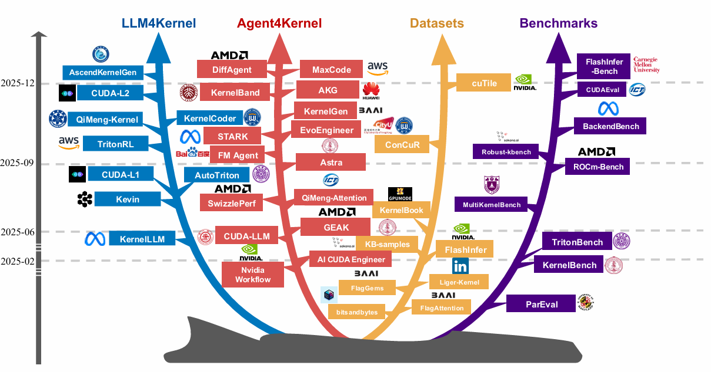

# Awesome-Kernel-Generations
LLM生成kernnel调研。目前已有一些使用LLM生成Kernels的综述：

[kcxain/Awesome-LLM4Kernel](https://github.com/kcxain/Awesome-LLM4Kernel)

将LLM4kernels分为四大类：

- Search-based piplines
- Agent-based pipelines
- Domain-specific Models
- Agentic RL

[flagosai/awesome-LLM-driven-kernel-generation]( https://github.com/flagosai/awesome-LLM-driven-kernel-generation)

目前正好也在调研LLM生成Kernels的相关工作，做一些补充。

# 数据集

这里关注的是cuda-kernels数据的生成。

|                                                              | 路径                                                         | 数量   | 说明                                                         |
| ------------------------------------------------------------ | ------------------------------------------------------------ | ------ | ------------------------------------------------------------ |
| [AI CUDA Engineer 数据集 ](https://sakana.ai/ai-cuda-engineer/) | https://huggingface.co/datasets/SakanaAI/AI-CUDA-Engineer-Archive | 30k    | 我们发布了 [AI CUDA Engineer 数据集 ](https://sakana.ai/ai-cuda-engineer/)，其中包含由 [AI CUDA Engineer](https://pub.sakana.ai/ai-cuda-engineer/paper) 生成的约 30,000 个 CUDA 内核。该数据集以 CC-By-4.0 许可发布，可通过 HuggingFace 访问，并[在此处](https://pub.sakana.ai/ai-cuda-engineer)进行交互式可视化。该数据集基于 [KernelBench](https://scalingintelligence.stanford.edu/KernelBenchLeaderboard/) 中提供的内核任务，包含 torch 参考实现、torch、NCU 和 Clang-tidy 的性能分析数据、每个任务的多个内核、错误信息以及相对于 torch 原生运行时和编译运行时的加速比得分。 |
| CUDA-Agent-Ops-6K                                            | https://huggingface.co/datasets/BytedTsinghua-SIA/CUDA-Agent-Ops-6K | 6k     | CUDA-Agent-Ops-6K 包含 6000 个合成的算子级训练任务， 专为大规模智能体强化学习训练而设计。其目的是提供多样化且可执行的面向 CUDA 的训练任务，并降低 KernelBench 评估的污染风险。 |
| CUDA-LLM                                                     | https://huggingface.co/datasets/ByteDance-Seed/cudaLLM-data  | 未说明 | 这是一个高质量的 PyTorch 算子测试用例数据集，旨在对 LLM 生成优化 CUDA 内核的能力进行基准测试和评估。该数据集提供了问题（标准 PyTorch nn.Module 实现）和解决方案（使用自定义 CUDA 内核的性能优化版本）的配对。它是高性能计算 (HPC) 人工智能、代码生成和编译器优化领域研究的宝贵资源。数据由 DeepSeek R1、DeepSeek Coder-7B 和 Qwen2-32B 生成。 SFT 数据集： sft_cuda_llm_r1.parquet RL 数据集： rl_cuda_llm_0424.parquet |
| hkust-nlp/drkernel-coldstart-8k                              | https://huggingface.co/datasets/hkust-nlp/drkernel-coldstart-8k | 8.9k   | 冷启动数据集用于在 DR.Kernel 中进行强化学习 (RL) 之前的监督微调 (SFT)。如论文所述，它由使用 KernelGYM 反馈收集的 5-turn multi-turn trajectories 构建而成。 |
| hkust-nlp/drkernel-rl-data                                   | https://huggingface.co/datasets/hkust-nlp/drkernel-rl-data   | 71k    | 与冷启动 SFT 数据集不同，此 RL 数据集主要是一个 single-turn query pool  （加上参考元数据），用于在 KernelGYM 中在线启动多轮滚动。 |

# 论文

## DR. KERNEL: Reinforcement Learning Done Right for Triton Kernel Generations

https://arxiv.org/pdf/2602.05885

### 核心贡献与方法

为了解决上述问题，作者提出了一套完整的解决方案，包括环境构建、算法改进和训练策略：

#### A. KERNELGYM：鲁棒的分布式训练环境

- 作者构建了 **KERNELGYM**，一个专为长周期 RL 训练设计的分布式 GPU 环境。
- **关键特性**：
  - **反欺骗检查 (Hacking Check)**：通过插桩 Triton 启动路径，严格检测生成的内核是否真正被执行，防止模型作弊。
  - **细粒度反馈**：提供基于性能分析（Profiling）的详细反馈，不仅告诉模型对错，还指出哪些算子占用了大部分时间，引导模型关注真正的瓶颈。
  - **容错与隔离**：能够处理 CUDA 运行时错误，确保训练长时间稳定运行。

#### B. 多轮强化学习算法改进 (TRLOO)

- 针对多轮交互（Multi-turn）场景，作者发现标准的 **GRPO** 算法存在**自包含偏差 (Self-Inclusion Bias)**，导致策略梯度估计有偏。
- **提出 TRLOO (Turn-level Reinforce-Leave-One-Out)**：一种无偏的优势估计方法，通过“留一法”计算基线，显著提高了多轮 RL 的训练效果和稳定性。

#### C. 克服“懒惰优化”的策略

为了让模型真正关注性能提升，作者引入了两项基于性能分析的技术：

1. **基于性能分析的奖励 (Profiling-based Rewards, PR)**：在奖励函数中增加一项，根据生成的内核占总 CUDA 运行时间的比例给予额外奖励，鼓励模型优化主要瓶颈。
2. **基于性能分析的拒绝采样 (Profiling-based Rejection Sampling, PRS)**：在训练采样阶段，过滤掉那些虽然正确但对整体性能贡献极低（即“懒惰”）的样本，提高训练数据的质量。

- 此外，还采用了**不匹配修正 (Mismatch Correction/MRS)** 来解决训练与推理引擎不一致导致的训练不稳定问题。

### 实验结果

- **模型表现**：训练出的模型 **DR. KERNEL-14B** 在 KernelBench 基准测试上表现优异。
  - 在 Level-2 子集上，**31.6%** 的生成内核实现了至少 **1.2倍** 的速度提升，超越了 Claude-4.5-Sonnet (26.7%) 和 GPT-5 (28.6%)。
  - 如果结合**顺序测试时扩展 (Sequential Test-Time Scaling, STTS)** 并选择历史最佳结果，这一比例进一步提升至 **47.8%**。
- **对比优势**：相比之前的 AutoTriton 等工作，DR. KERNEL 不仅在正确性上达标，更在**实质性速度提升**（Fast@1.2, Fast@1.5 等严格指标）上取得了显著突破，有效避免了奖励欺骗和懒惰优化。

## CUDAAgent: Large-Scale Agentic RL for High-Performance CUDA Kernel Generation

https://arxiv.org/pdf/2602.24286

### CUDA Agent 的核心设计

该系统通过三个关键维度的创新来实现突破：

#### A. 可扩展的数据合成流水线 (Scalable Data Synthesis)

- 为了解决高质量 CUDA 训练数据稀缺的问题，作者设计了一个三阶段流程：
  - **种子问题爬取：** 从 PyTorch 和 Transformers 库中挖掘基础算子。
  - **组合问题合成：** 利用 LLM 将多个基础算子组合成复杂的融合任务（Fused Tasks），因为融合任务的优化空间远大于单个算子的简单叠加。
  - **基于准则的过滤：** 严格筛选可执行、非随机、非平凡（non-trivial）且工作量合理的问题，最终构建了包含 6,000 个样本的训练数据集 **CUDA-Agent-Ops-6K**。

#### B. 技能增强的智能体环境 (Skill-Integrated Agent Environment)

- **标准化工作流：** 定义了专门的 `SKILL.md`，指导模型遵循“分析瓶颈 -> 实现自定义算子 -> 编译评估 -> 迭代优化”的标准流程。
- **自动化工具链：** 集成了自动化测试和性能剖析（Profiling）脚本，提供基于执行的反馈。
- **防黑客奖励机制：**
  - 实施严格的权限隔离，防止模型修改验证逻辑。
  - 禁止调用 fallback 实现（如 `torch.nn.functional`），确保加速来自生成的 CUDA 代码。
  - **鲁棒的奖励调度：** 提出了一种离散化的奖励方案（-1, 1, 2, 3分），不仅考虑正确性，还根据是否显著优于 Eager 模式和 `torch.compile` 模式给予不同等级的奖励，避免了单纯使用加速比作为奖励带来的噪声和不稳定性。

#### C. 稳定的强化学习算法 (Stable RL Techniques)

- **问题：** 直接进行多轮 Agentic RL 训练极易不稳定，模型性能会在约 17 步后崩溃。原因是基座模型缺乏 CUDA 先验，导致采样分布偏移和重要性采样比率爆炸。
- **解决方案：多阶段预热策略**
  - **单轮 RL 预热：** 先在单轮生成任务上进行 PPO 训练，提升基础能力。
  - **拒绝采样微调 (RFT)：** 收集单轮 RL 产生的高质量轨迹，过滤掉低奖励或行为无效的样本，用于初始化 Actor 模型，约束策略熵。
  - **价值函数预训练 (Value Pretraining)：** 利用轨迹数据预训练 Critic 模型，使其能准确评估状态价值，防止智能体陷入无效的长循环搜索。
- **效果：** 该策略使得模型能够稳定训练长达 150-200 步，并支持 128k 的上下文窗口。

### 实验结果

在 **KernelBench** 基准测试（涵盖 Level 1 到 Level 3 难度的 250 个任务）上，CUDA Agent 取得了 State-of-the-Art (SOTA) 的结果：

- **对比** **`torch.compile`****：**
  - **Level 1 (单算子)：** 加速比 **2.48x** (99% 的任务更快)。
  - **Level 2 (算子序列)：** 加速比 **2.80x** (100% 的任务更快)，展示了极强的算子融合能力。
  - **Level 3 (复杂模型，如 ResNet)：** 加速比 **1.52x** (90% 的任务更快)。
  - **总体几何平均加速比：** 相比 `torch.compile` 提升了 **2.11x**。
- **对比顶级专有模型：**
  - 在最具挑战性的 Level 3 任务上，CUDA Agent 的表现比 **Claude Opus 4.5** 和 **Gemini 3 Pro** 高出约 **40%**（以加速率 Faster Rate 衡量）。
  - 即使基座模型（Seed1.6）本身较弱，经过 Agentic RL 训练后，其性能也全面超越了未针对 CUDA 特化的最强闭源模型。

## StitchCUDA: An Automated Multi-Agents End-to-End GPU Programing Framework with Rubric-based Agentic Reinforcement Learning

https://arxiv.org/pdf/2603.07169

### StitchCUDA 的核心设计

StitchCUDA 通过以下三个专用智能体协作来解决上述问题：

- **Planner（规划者）：** 分析参考 PyTorch 代码，利用 Nsys 进行性能剖析，识别系统瓶颈，并将任务分解为具体的子任务列表（包括内核融合边界、张量形状等）。
- **Coder（编码者）：** 根据规划逐步实现 CUDA 代码和主机端逻辑。该智能体经过专门的**基于准则的强化学习**训练。
- **Verifier（验证者）：** 负责正确性检查和性能分析（使用 Nsys/NCU），提供具体的优化建议或错误修复指导，形成“规划 - 编码 - 剖析 - 修正”的迭代闭环。

### 关键技术创新：基于准则的智能体强化学习

为了提升 Coder 的能力并降低训练成本，作者提出了独特的 RL 策略：

- **原子技能分解：** 将复杂的多轮交互分解为两个原子技能进行单轮训练：
  - **从头生成（Task-to-code）：** 根据任务要求生成初始代码。
  - **反馈驱动优化（Feedback-driven optimization）：** 根据验证者的反馈修改代码。
  - *优势：* 大幅降低了多轮 rollout 的计算开销。
- **基于准则的奖励（Rubric-based Reward）：** 除了传统的规则奖励（正确性和加速比），引入了由专家定义的准则奖励，从四个维度评估代码：
  - **反黑客（Anti-Hacking）：** 惩罚投机取巧的行为。
  - **CUDA 工程能力：** 奖励高级优化技术（如张量核心、内核融合、异步拷贝等）。
  - **算子覆盖率：** 鼓励对复杂程序中更多算子进行优化。
  - **技能合规性：** 确保遵循任务要求或反馈指令。
  - *优势：* 有效防止了模型走捷径（如只写一个简单的 ReLU 内核而忽略主要的 Conv2D 瓶颈），引导模型学习真正的高级优化技术。

### 实验结果

在 **KernelBench** 基准测试（特别是高难度的 Level 3 端到端任务）上，StitchCUDA 表现优异：

- **成功率：** 在 Level 3 任务上实现了近 **100%** 的成功率。
- **性能加速：** 相比 PyTorch Eager 模式，平均实现了 **1.5 倍** 的端到端加速。
- **对比优势：**
  - 比单纯的多智能体基线方法（如 CUDAForge）快 **1.72 倍**。
  - 比单纯的 RL 模型基线（如 Kevin-32B）快 **2.73 倍**。
  - 即使与更强大的 GPT-5.2 作为后端相比，StitchCUDA（使用较小的 32B 模型）在 Level 3 任务上也取得了更好的结果。

## Making LLMsOptimize Multi-Scenario CUDA Kernels Like Experts

https://arxiv.org/pdf/2603.07169

### 核心贡献一：MSKernelBench（多场景基准测试）

为了解决上述问题，作者提出了 **MSKernelBench**，这是一个全面的 CUDA 算子优化基准测试套件。

- **覆盖面广**：包含 **50 个任务**，涵盖四大类场景：
  - **基础代数运算**（如点积、矩阵乘法）
  - **常见 LLM 算子**（如 RMSNorm, SwiGLU, RoPE）
  - **稀疏矩阵运算**（如 SpMV, SpMM，支持 CSR, COO, CSC, ELL 等多种格式）
  - **科学计算例程**（如Stencil计算、卷积、FFT、排序、积分等）
- **多精度支持**：每个任务都实现了 **FP32** 和 **BF16** 两种精度。
- **纯 C/CUDA 实现**：为了去除框架干扰，直接基于纯 C 语言编写，更接近底层 HPC（高性能计算）场景。
- **多维评估**：不仅看是否编译通过，还要在不同数据规模下验证数值正确性，并计算**复杂度加权后的平均加速比**。这意味着在大尺寸数据上表现好的优化会获得更高的评分。

### 核心贡献二：CUDAMaster（多智能体优化系统）

基于 MSKernelBench，作者提出了 **CUDAMaster**，一个像专家一样工作的多智能体系统，用于自动优化 CUDA 内核。

**工作原理（模拟人类专家）：**

人类专家优化内核通常遵循“分析瓶颈 -> 提出策略 -> 编写代码 -> 编译运行 -> 调试修正”的循环。CUDAMaster 将这一过程自动化：

**硬件分析过滤器 (Hardware Analysis Filter)**：

1. **痛点**：性能分析工具（如 Nsight Compute）产生的数据量巨大且杂乱。
2. **创新**：系统首先根据吞吐量指标（计算利用率、显存带宽利用率等），利用算法（Otsu's method）自动将任务分类为三种瓶颈类型：**计算受限 (Compute Bound)**、**内存延迟受限 (Memory Latency Bound)**、**内存带宽受限 (Memory Bandwidth Bound)**。
3. **作用**：根据分类，**只提取与该瓶颈最相关的关键指标**喂给 LLM，去除噪声，让 LLM 聚焦于核心问题。

**多智能体协作 (Multi-Agent System)**： 系统包含四个专用智能体，迭代工作：

1. **Planner Agent (规划者)**：分析过滤后的性能数据和历史结果，提出**单一的、增量式**的优化策略（例如：“尝试使用共享内存分块”或“展开循环”）。它不写代码，只出方案。
2. **Coder Agent ( coder)**：根据规划者的策略，编写或修改 CUDA 代码。它严格遵循代码规范（如函数命名后缀 `_optimized`），确保能嵌入测试框架。
3. **Compiler Agent (编译器)**：生成合适的 `nvcc` 编译命令，处理头文件链接和架构标志。
4. **Debug Agent (调试员)**：如果代码编译失败或运行结果错误，该代理负责分析错误日志（编译错、CUDA 内存错、数值误差），并提出修复方案。

**迭代流程**： 系统会进行多轮迭代（默认 3 轮），每轮尝试新的优化策略。如果出错，会触发有限次数（默认 3 次）的调试 subprocess，直到代码正确且性能提升。

# 实验结果

- **模型表现**：使用了 **OpenAI o4-mini** 和 **DeepSeek-V3.2** 作为基座模型。o4-mini 表现更好。
- **整体加速**：CUDAMaster 在大多数算子上实现了显著加速，相比之前的先进系统 **Astra**，平均性能提升了约 **35%**。
- **媲美专家库**：在某些任务上，生成的代码性能甚至**匹配或超越**了高度优化的闭源库（如 **cuBLAS**, **cuSPARSE**, **cuDNN**）。
  - 例如：在稀疏矩阵向量乘法 (SpMV CSR) 上超越了 cuSPARSE；在 2D 卷积上超越了 cuDNN；在点积运算上超越了 cuBLAS。
- **消融实验证明**：
  - **迭代与调试至关重要**：去掉调试环节或多轮迭代，成功率大幅下降。
  - **过滤配置文件有效**：使用“过滤后的性能数据”比“无性能数据”或“全量性能数据”效果更好，且能节省约 30% 的 Token 消耗和成本。

### 总结

这篇文章的核心价值在于：

1. **建立了新标准**：MSKernelBench 填补了多场景、底层 CUDA 优化基准的空白，不再局限于 LLM 算子。
2. **证明了 LLM 的潜力**：通过 CUDAMaster 展示了 LLM 智能体在结合硬件感知（Profile-guided）和多角色协作后，能够像人类专家一样处理复杂的、非标准的 GPU 优化任务，甚至在某些领域达到工业级库的水平。
3. **方法论创新**：提出的“瓶颈分类 + 关键指标过滤”机制，有效解决了 LLM 面对海量性能数据时的“注意力分散”问题，提高了优化的针对性和效率。

简单来说，这就好比以前老师（LLM）只擅长做特定的几种数学题（LLM 算子），现在作者出了一本涵盖代数、几何、微积分等各种难题的新习题集（MSKernelBench），并教给老师一套“先诊断病因、再对症下药、最后检查纠错”的标准解题流程（CUDAMaster），结果发现老师现在不仅能做新题，做出来的答案甚至比参考答案（官方库）还要快！

## Kevin: Multi-Turn RL for Generating CUDA Kernels

https://arxiv.org/pdf/2507.11948

### 主要贡献：Kevin 模型

- **模型名称**：Kevin (K(ernel) D(evin))。
- **基座模型**：基于 QwQ-32B 进行训练。
- **训练方法**：
  - **多轮轨迹**：在每个训练步骤中，模型会进行多轮对话（生成代码 -> 获取执行反馈 -> 总结思考 -> 再次生成）。
  - **奖励机制**：设计了复杂的奖励聚合策略，不仅奖励最终结果，还通过折扣因子奖励那些虽然不完美但能引导至更好结果的中间步骤。
  - **上下文管理**：为了解决长上下文问题，模型会对之前的思维链（CoT）进行总结，只保留关键信息传递给下一轮。
  - **防作弊**：针对模型可能直接复制参考代码（Reward Hacking）的问题，实施了严格的格式检查和规则限制。

### 实验结果

在 KernelBench 基准测试（100 个未见过的任务）上的表现：

- **正确率大幅提升**：从基座模型的 56% 提升至 **82%**。
- **性能显著优化**：生成的内核相对于 PyTorch Eager 基准的平均加速比从 0.53x 提升至 **1.10x**（意味着比默认 PyTorch 实现更快）。
- **超越前沿模型**：性能优于 OpenAI 的 o4-mini（加速比 0.78x）和 o3-mini 等模型。
- **推理扩展性**：研究发现，增加**串行优化轮数**（Serial Refinement）比增加并行采样（Parallel Sampling）更能提升效果。Kevin 模型随着优化轮数的增加，性能提升曲线更陡峭，显示出更强的迭代优化能力。

### 关键发现

- **多轮训练优于单轮**：无论是训练阶段还是推理阶段，多轮交互的设置都显著优于单轮设置。
- **迭代的重要性**：模型学会了在后续轮次中进行更激进的优化（如循环展开、内存合并等），这是单轮模型难以做到的。
- **稳定性挑战**：长时间的多轮 RL 训练可能导致模型不稳定（产生乱码），作者通过梯度裁剪等技术缓解了这一问题。

## QiMeng-Kernel: Macro-Thinking Micro-Coding Paradigm for LLM-Based High-Performance GPU Kernel Generation

https://arxiv.org/pdf/2511.20100

### 核心方法：MTMC (Macro-Thinking Micro-Coding)

为了解决上述问题，作者提出了一种分层框架，模仿人类专家的阶段性优化策略，将**优化策略**与**实现细节**解耦：

- **宏观思考 (Macro Thinking)：**
  - **目标：** 负责高层的语义优化策略（如算子融合、分块、流水线等），不涉及具体代码实现。
  - **方法：** 使用**强化学习 (RL)** 训练轻量级 LLM。它根据硬件特征和当前代码状态，逐步生成语义层面的优化建议（Action），以最大化硬件利用率。
  - **优势：** 通过解耦，只需在紧凑的人工 curated 数据集上训练策略，无需海量数据，且能高效探索优化空间。
- **微观编码 (Micro Coding)：**
  - **目标：** 负责将宏观思考提出的优化建议转化为具体的、语法正确的代码。
  - **方法：** 利用强大的**通用 LLM**，根据宏观层给出的具体步骤（优化类型和代码区域）进行增量式的代码修改。
  - **优势：** 避免了全量生成代码带来的错误累积，利用通用 LLM 在原子代码实现上的优势，确保正确性。

### 主要成果与性能表现

文章在广泛使用的基准测试（KernelBench 和 TritonBench）上进行了评估，结果显示 MTMC 显著优于现有的最先进（SOTA）方法：

- **准确性 (Accuracy)：**
  - 在 **KernelBench** 上，MTMC 在 Level 1-2 任务中达到了近 **100%** 的准确率，Level 3 任务达到 **70%**，比通用 LLM 和领域微调 LLM 高出 50% 以上。
  - 在更具挑战性的 **TritonBench** 上，准确率高达 **59.64%**。
- **性能加速 (Speedup)：**
  - 相比通用 LLM，速度提升最高达 **7.3倍** (KernelBench) 和 **34倍** (TritonBench)。
  - 相比专家优化的 PyTorch Eager 内核，速度提升最高达 **2.2倍**。
- **通用性：** 该方法在不同的 GPU 架构（V100, A100, H100）和不同的 LLM 基座上都表现出了强大的泛化能力。

## Fine-Tuning GPT-5 for GPU Kernel Generation

https://arxiv.org/pdf/2602.11000

### 核心方法：基于可验证奖励的强化学习 (RLVR)

为了解决数据稀缺问题，作者提出使用**强化学习从可验证奖励（RLVR）**来微调模型，而不是依赖大量标注数据。

- **奖励机制：** 设计了确定性的、基于规则的奖励函数。模型生成的内核会通过编译、功能正确性验证（与参考 PyTorch 代码对比输出）以及性能基准测试（计算相对于 TorchInductor 的加速比）来获得奖励。
- **基础模型选择：** 选择了 **GPT-5** 作为基础模型，因为它已经具备了较强的代码生成能力和对 Triton/GPU 编程的基本理解，能够避免强化学习初期的“冷启动”问题（即生成的代码完全无法编译导致无奖励信号）。
- **防奖励黑客（Reward Hacking）：** 针对模型可能通过调用基线算子、执行空操作或忽略输出等“作弊”手段获取高分的问题，文章引入了**静态可达性分析**和**LLM 法官**机制来检测并惩罚这些行为。

### 基础设施与工具 (Makora Environment)

文章详细介绍了一套名为 **Makora** 的评估和训练环境：

- **可扩展的后端：** 支持在 H100 等 GPU 上并行编译、验证和基准测试生成的内核。
- **工具增强：** 为模型配备了多种工具，使其能在生成过程中进行迭代优化：
  - **内核评估器 (Kernel Evaluator)：** 提供编译错误、运行时错误或性能反馈。
  - **内核搜索 (Kernel Search)：** 检索之前生成的有效内核作为起点。
  - **网络搜索 (Web Search)：** 查找优化策略和技术文档。
  - **性能分析器 (Profiler)：** 提供细粒度的性能瓶颈分析。
- **数据构建：** 构建了一个多样化的训练数据集，涵盖了矩阵乘法、卷积、归约等多种计算模式，并进行了严格的去重和难度分级。

### 主要实验结果

通过在 KernelBench 基准测试集上的评估，微调后的 GPT-5 模型（GPT-5-RL）取得了state-of-the-art（SOTA）的效果：

- **单次尝试（Single-attempt）：**
  - **功能正确率：** 从基线 GPT-5 的 43.7% 提升至 **77.0%**（提升 33.3 个百分点）。
  - **超越编译器比例：** 优于 TorchInductor 的比例从 14.8% 提升至 **21.8%**。
  - **几何平均加速比：** 达到 0.81x（相对于 TorchInductor）。
- **结合智能体（MakoraGenerate Agent）：**
  - 当将该模型集成到多智能体系统中并进行多次迭代优化时，系统能解决高达 **97.4%** 的问题。
  - 在 **72.9%** 的问题上超越了 TorchInductor 编译器。
  - 实现了 **2.12 倍** 的几何平均加速比。
- **与其他模型对比：** GPT-5-RL 在功能正确率和性能上均显著优于 Gemini 2.5 Pro, Claude Opus 4.5, Grok 等其他前沿模型。

# 评估Benchmark

## **ComputeEval (NVIDIA, 2025版本)**

https://github.com/NVIDIA/compute-eval

NVIDIA 官方开源的 CUDA 代码生成评估框架。2025下半年扩展至 232 个难题，要求模型掌握最前沿的架构特性（如 Tensor Cores 操作、CUDA Graphs、复杂共享内存模式、Warp 级原语等）。目前即便是 GPT-5 / Claude 4 等顶级模型，在此测试上仍存在较大的失误率，是极具挑战性的 Benchmark。

## **CUDABench (2026年2月)**

https://github.com/CUDA-Bench/CUDABench

专注于 **Text-to-CUDA（自然语言直接生成CUDA）**，涵盖科学计算、数据分析等领域，不仅测算功能一致性，还引入了基于 Roofline 模型的性能打分（Performance-Score）。

### 研究背景与动机

- 现有局限：目前的基准测试（如 KernelBench）主要关注将高级语言（如 PyTorch）翻译成 CUDA 代码，忽略了更具挑战性的“从文本直接生成 CUDA”的任务。
- 评估难点：GPU 编程对硬件特定性和性能极其敏感。仅凭功能正确性不足以评估生成的内核质量，因为一个能运行但性能低下的内核在实际应用中价值有限。
- 目标：需要一个能覆盖多领域、多难度，且能同时评估正确性和硬件无关的性能的基准。

### CUDABench 的核心组成

文章提出了两个主要组成部分：

#### A. CUDABench-Set（数据集）

构建了一个具有广度 - 深度 - 难度三维评估空间的数据集：

- 广度 (Breadth)：涵盖 6 个主要应用领域，包括基础线性代数、深度学习算子、计算机视觉、数据分析、信号处理、科学计算与金融。共包含 500 个任务。
- 深度 (Depth)：针对每个任务设计了 5 种不同的输入规模（从 Tiny 到 Huge，最大超过 1GB），以模拟真实生产环境并测试硬件压力下的表现。
- 难度 (Difficulty)：设置了三个提示词难度等级：
  - Level 1：提供详细的算法描述和 CUDA 实现指南（引导式）。
  - Level 2：仅提供算法描述，无硬件特定指导。
  - Level 3：仅提供任务名称，要求模型自主检索领域知识（零样本）。

#### B. CUDABench-Score（评估指标）

提出了一套新的评估流程和评分标准：

- 生成验证流水线：自动化执行编译测试、基于执行的功能一致性验证（对比参考输出）。
- Performance-Score：引入基于 Roofline 模型 的性能指标。它不单纯看运行时间（受硬件影响大），而是计算“实际性能”与“理论峰值性能”的比率。这使得评分在不同 GPU 硬件之间具有可比性（硬件无关）。
- 最终得分：综合了编译成功率、功能一致性和 Performance-Score。

### 主要实验发现

作者使用最新的 LLM（如 GPT-5.2, Claude 4.5, Gemini 3 等）进行了广泛测试，发现了以下关键问题：

1. 高编译率，低功能正确率：模型很容易写出能通过编译的代码（语法正确），但在逻辑和功能上经常出错。例如，Claude 4.5 Sonnet 编译成功率接近 100%，但功能正确率显著较低。
2. 缺乏领域特定知识：随着提示词难度增加（特别是 Level 3，不提供算法细节），所有模型的性能都急剧下降。这表明 LLM 内部缺乏深层的并行编程和特定算法（如科学计算中的复杂算法）知识。
3. 硬件资源利用率低：即使生成的代码功能正确，其性能也远未达到硬件极限。顶级模型的性能得分（Performance-Score）通常只有 40% 左右，意味着约 60% 的 GPU 计算资源未被有效利用。模型难以自动生成针对硬件架构优化的代码（如内存合并访问、共享内存优化等）。
4. 多尝试可提升结果：Pass@3（尝试 3 次中至少一次成功）的指标显著高于 Pass@1，说明通过多次采样或更好的推理策略，模型有潜力生成更好的代码。

## **KernelBench & TritonBench**

https://github.com/ScalingIntelligence/KernelBench

https://github.com/thunlp/TritonBench

业界公认的两大基准。提供 PyTorch 原生实现作为基线，评测指标为 `Pass@k`（能否在 K 次内生成编译通过且结果一致的代码）以及 **Speedup（相较于 PyTorch 的加速倍率）**

# 其余资源

[Agent 时代如何开发 Kernel？开源项目 Skills 全面调研](https://zhuanlan.zhihu.com/p/2015824320404934847)

[LLM4Kernel 工作阶段汇总（26年1月-2月）](https://zhuanlan.zhihu.com/p/2010295337953292542)

[maxiaosong1124/ncu-cuda-profiling-skill: let coding agents use ncu skills analysis cuda program automatically!](https://github.com/maxiaosong1124/ncu-cuda-profiling-skill)
