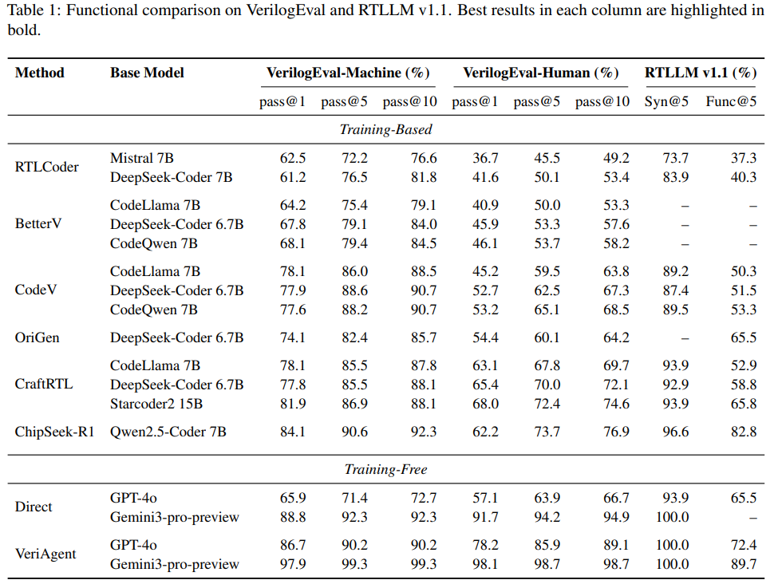

# 1. SOTA模型
## 1.1. 大模型的基础能力
由 Gemini-3-Pro 领跑（覆盖率87.5%，HQI 85.1），紧随其后的是 GPT-5.4-Pro、Claude-4.6 等顶尖闭源模型。

Synthesis-in-the-Loop Evaluation of LLMs for RTLGeneration: Quality,Reliability,and FailureModes

https://arxiv.org/pdf/2603.11287

- 现有评估的局限性： 目前对大语言模型（LLM）生成硬件描述语言（如Verilog）的评估主要停留在功能正确性（即通过仿真测试bench）。然而，硬件设计不仅要求功能正确，还必须满足可综合性（能转化为门电路）和实现质量（面积、时序效率）。
- 差距： 许多能通过仿真的代码在实际综合时会失败，或者生成的硬件效率极低（面积或延迟比专家设计差数倍）。现有的基准测试忽略了这一关键差距。
作者提出了一套新的评估流程，包含三个连续关卡：
1. 语法有效性： 使用 Icarus Verilog 解析。
2. 可综合性： 使用 Yosys 工具配合 Nangate 45nm 工艺库进行综合，确保代码能转化为网表。
3. 功能正确性： 通过测试bench仿真。
引入新指标：硬件质量指数 (HQI)
- 这是一个 0-100 分的评分系统。
- 只有通过了上述所有关卡的设计才会得分。
- 得分基于生成设计与专家参考设计（Golden Reference）在综合后面积、延迟和警告数量上的对比。100分表示与专家设计持平。
根据 Global HQI（最佳表现），32个模型清晰地分为三个梯队：
- 第一梯队 (Tier 1, HQI ≥ 71)： 共13个模型。由 Gemini-3-Pro 领跑（覆盖率87.5%，HQI 85.1），紧随其后的是 GPT-5.4-Pro、Claude-4.6 等顶尖闭源模型。
- 第二梯队 (Tier 2, HQI 53–68)： 共11个模型。包括 GPT-4o、Gemini-2.5-Pro 以及最强的开源模型（如 DeepSeek-V3.2, Qwen3.5）。开源模型与顶尖闭源模型仍有约15-20分的差距。
- 第三梯队 (Tier 3, HQI < 53)： 共8个模型。包括一些基础版模型（如 GPT-5 base）和较小的开源模型。

## 1.2. 垂域小模型

## 1.2.1. QiMeng-SALV
QiMeng-SALV: Signal-Aware Learning for Verilog Code Generation

https://arxiv.org/pdf/2510.19296

https://github.com/QiMeng-IPRC/QiMeng-SALV

文章提出从传统的“模块级”优化转向细粒度的“信号级”优化。其核心思想是：即使在整体错误的模块中，也可以提取出功能正确的信号代码片段，并利用这些片段来提供有意义的功能奖励，以优化 RL 训练。

主要技术步骤包括：
1. 信号感知验证 (Signal-aware Verification)： 通过生成随机输入激励，对比生成模块与参考模块的输出信号，识别出哪些具体的输出信号是功能正确的。
2. 信号感知代码提取 (Signal-aware Code Extraction)： 利用抽象语法树（AST）分析，构建信号依赖图，从生成的代码中精确提取出与正确输出信号相关的代码片段。
3. 信号感知 DPO 训练 (Signal-aware DPO)： 改进现有的直接偏好优化（DPO）算法。在计算损失函数时，只关注与“对比信号”（即在优选样本中正确而在劣选样本中错误的信号）相关的代码片段，忽略其他错误部分的干扰。这使得模型能够从部分正确的样本中学习，扩大了有效训练数据的范围。

## 1.2.2. QiMeng-CodeV-R1

QiMeng-CodeV-R1: Reasoning-Enhanced Verilog Generation

https://arxiv.org/pdf/2505.24183

https://github.com/iprc-dip/CodeV-R1

- 基于规则的自动化测试平台生成器 (Automated Testbench Generation)：
  - 开发了一个规则驱动的框架，能够分析电路结构（提取 I/O、时钟、复位信号）。
  - 通过枚举所有复位和时钟同步场景，生成鲁棒的测试平台进行等价性检查。
  - 实验表明，该方法比 LLM 生成的测试平台减少了 96.1% 的假阴性率，并能更有效地检测时序电路中的错误。
- 往返数据合成 (Round-Trip Data Synthesis)：
  - 提出了一种从开源 Verilog 代码片段合成高质量数据的方法。
  - 流程：代码 -> LLM 生成自然语言描述 -> LLM 根据描述再生成代码 -> 使用自动化测试平台验证新生成的代码与原代码是否功能等价。
  - 只有经过验证等价的“自然语言 - 代码”对才会被保留，从而确保数据的高质量。
- “蒸馏 + 强化学习”两阶段训练与自适应 DAPO 算法：
  - 第一阶段（蒸馏）：利用 DeepSeek-R1 等强模型生成带有思维链（Thought）的数据，对基座模型进行监督微调（SFT），赋予其初步的推理能力。
  - 第二阶段（强化学习）：使用筛选后的高质量数据进行 RL 训练。
  - 自适应 DAPO：提出了一种改进的强化学习算法（Adaptive DAPO），能根据历史采样丢弃率动态调整每步的采样数量，减少了不必要的采样和验证开销，实现了 1.25 倍 的加速。

## 1.2.3. SiliconMind-V1
SiliconMind-V1: Multi-Agent Distillation and Debug-Reasoning Workflows for Verilog Code Generation

https://arxiv.org/pdf/2603.08719

https://github.com/AS-SiliconMind/SiliconMind-V1

该框架包含两个主要组成部分：
A. 多智能体训练数据流水线 (Multi-Agent Training Data Pipeline)
为了解决数据稀缺和质量问题，作者设计了一个两阶段的自动化数据生成流程：
1. 训练代码生成阶段 (Training Code Generation)： 利用四个专用智能体（修订、解决方案、测试平台、验证）从公开来源提炼问题，生成带有详细推理轨迹（Reasoning Traces）和功能验证通过的测试平台（Testbenches）的高质量数据对。
2. 自我纠错阶段 (Self-Correction)： 利用初步训练的模型（SiliconMind-dev）识别自身弱点，针对易错样本生成专门的测试报告和调试课程数据，从而增强模型的自测和调试能力。
B. SiliconMind 推理引擎 (Inference Engine)
为了在推理时最大化模型潜力，提出了三种策略：
1. 常规策略 (Regular)： 引导模型在生成代码前进行思考。
2. 深度思考策略 (Deep Thinking)： 强制模型在单次响应中完成“初始生成 - 测试 - 调试”的全过程。
3. 代理策略 (Agentic)： 将生成、测试和调试拆分为多个交互步骤，允许模型迭代优化代码直到通过验证，实现了测试时缩放（Test-Time Scaling）。

# 2. 相关方法

[Large Language Model for Verilog Code Generation: Literature Review and the Road Ahead] (https://arxiv.org/pdf/2512.00020)

## 2.1. 无需训练
免训练方法无需更新额外参数即可增强 Verilog 代码生成能力，因此在计算资源有限的情况下极具吸引力。它们主要依赖于 EDA 工具反馈、提示工程（Prompt Engineering）以及推理时的解码优化。

### 2.1.1.  EDA 工具反馈 (EDA-Tool Feedback)
EDA 工具反馈代表了基于大语言模型（LLM）的 Verilog 生成技术的重大进步。在该方法中，行业标准的验证和综合工具提供具体的诊断信息（如语法错误、功能不匹配、时序违例、PPA 指标），以指导迭代优化。与纯粹的自我修正或仅依赖测试用例的方案相比，这创建了一个闭环反馈机制，使代码能够从语法正确性逐步提升到物理实现的可行性。目前的方法可分为单智能体（Single-Agent）和多智能体（Multi-Agent）框架。

(1) 单智能体系统 (Single-Agent Systems)

单智能体系统采用单个 LLM，通过消耗 EDA 反馈并利用自我修正和定制提示来迭代优化 Verilog 代码。
- VeriPPA [103] 提出了一种双阶段流程：首先使用 iverilog 仿真器反馈修复语法/功能错误，然后利用 Synopsys Design Compiler 的报告，通过一个名为 VeriRectify 的模块指导 PPA（功耗、性能、面积）优化，探索流水线、时钟门控和并行化技术。
- LLM-Powered RTL Assistant [55] 模仿人类工作流程，设计了三种提示类型：初始提示（分配“专业 Verilog 设计师”角色并制定分步计划）、自我验证提示（用于生成测试用例和行为分析）以及自我修正提示（结合 Icarus Verilog 的错误日志）。
- RTLFixer [105] 针对语法修复，使用 ReAct 风格的“思考–行动–观察”循环，将编译器反馈与基于 RAG（检索增强生成）的专家知识检索相结合。
- Paradigm-Based HDL Generation [96] 通过三个范式块模拟人类设计：COMB 块提取并简化真值表（使用 PyEDA）为积之和表达式；SEQU 块推导状态转换表以生成“三 always 块”设计；BEHAV 块将复杂行为分解为更小的组件。
- EvoVerilog [47] 结合了 LLM 推理与进化搜索：思维树初始化候选设计，四个子代算子探索设计空间，非支配排序平衡测试用例不匹配最小化与硬件成本。
- VGV [121] 扩展至多模态输入，利用多模态大模型（MLLMs）提供两种视觉模式：基础视觉（直接图转代码）和思考视觉（先进行组件描述再生成代码）。

总体而言，单智能体系统表明，精心设计的反馈循环可以在不增加额外模型的情况下显著提高正确性和 PPA 指标。

(2) 多智能体系统 (Multi-Agent Systems)

多智能体系统部署多个专用的 LLM，通过基于角色的任务分解和共享的 EDA 反馈进行协作，利用“集体智能”处理复杂的 Verilog 设计。
- 基础双/三智能体框架：
  - AIVRIL [106] 使用代码智能体（负责 RTL 和测试用例生成）和审查智能体（负责日志分析和修正建议），形成自动审查（语法）和自动动态验证（功能）循环，支持 Claude 3.5 Sonnet、GPT-4o 和 Llama3-70B。
  - LLM-aided Front-End Framework [48] 串联三个模型：$h^{(1)}_\theta$ 生成 RTL，$h^{(2)}_\theta$ 生成测试用例，$h^{(3)}$ 利用仿真输出审查设计。
  - RTL Agent [92] 采用受 Reflexion 启发的生成器–审查器架构，表明在使用 GPT-4o-mini/GPT-4o 时，更广泛的并行探索优于更深度的迭代。
- 高级框架（引入更丰富的角色专业化）：
  - MAGE [139] 协调四个智能体：测试用例生成器（生成利于波形观察的输出）、RTL 生成器（含语法检查）、评判智能体（基于仿真评分）和调试智能体（迭代修复），结合了高温采样、Top-K 选择和归一化不匹配评分。
  - VerilogCoder [50] 集成了任务规划器（使用任务 - 电路关系图）、带有语法验证助手的代码智能体，以及利用 Icarus Verilog、Verilog 仿真（VCD）和基于 AST 的波形追踪器（Pyverilog）进行不匹配定位的调试智能体。
  - CoopetitiveV [75] 使用四个角色——代码生成器、研究智能体、检察官智能体和修订智能体（负责代码/测试用例），实现长达两轮 Icarus Verilog–AutoBench 迭代的竞争–合作优化。
- 面向可扩展性的系统（采用分层或以工作流为中心的设计）：
  - Nexus [95] 采用分层监督架构（根监督器、任务监督器和用于 Xilinx Vivado CLI 的 EDA 智能体），由 YAML 配置的提示以及时序/资源/功耗报告驱动以实现收敛。
  - RTLSquad [109] 组织探索小队（功耗/面积/性能智能体进行投票）、实现小队（程序员和审查员携带任务清单）和验证小队（观察者和分析器），使用基于分数的探索调整以提高可解释性。
  - VFlow [119] 通过合作进化种群蒙特卡洛树搜索（CEPE-MCTS）自动化工作流发现，维护四个种群（功能、面积、时序、多目标），支持片段迁移和失败经验共享，并集成语法、仿真、波形、优化和组合算子。
- 近期工作强调 PPA 优化和大规模 RTL：
  - VeriOpt [98] 在 PPA 感知的上下文学习中协调规划器、程序员、审查器和评估器智能体，执行两阶段迭代（功能正确性 followed by Synopsys Design Compiler 对功耗、性能和面积的优化）。
  - AutoSilicon [60] 针对复杂的工业级 RTL，通过三个智能体：具有任务分解和多版本投票功能的设计师智能体、具有持久调试记忆和用于波形查询的语义检索功能的内存调试智能体，以及用于依赖管理的任务调度器，结合 Icarus Verilog 和 Synopsys Design Compiler (ASAP 7nm PDK)。
  - VeriMind [79] 引入五个智能体（监督器、提示工程师、Verilog 代码生成器、测试用例生成器、检查器）和 pass@ARC 指标，该指标在传统 pass@k 基础上增加了平均轮次计数惩罚，以 penalize 过长的修复序列。
这些多智能体系统共同表明，协调专业化可以显著增强 Verilog 生成的鲁棒性、可扩展性和 PPA 优化能力。

### 2.1.1.1. VerilogAgent

VeriAgent: A Tool-Integrated Multi-Agent System with Evolving Memory for PPA-Aware RTL Code Generation

https://arxiv.org/pdf/2603.17613

使用gemini-3.o-pro加上agent系统，效果就很好了。

