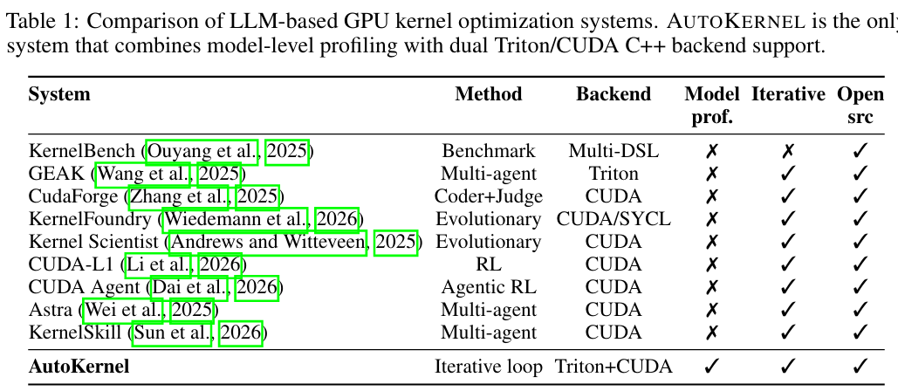

AutoKernel: Autonomous GPU Kernel Optimization via Iterative Agent-Driven Search

https://arxiv.org/pdf/2603.21331

这是一篇关于 **AutoKernel** 的深度技术解析文章。这篇论文《AutoKernel: Autonomous GPU Kernel Optimization via Iterative Agent-Driven Search》由 RightNow AI 团队撰写，提出了一种极具创新性的方法，旨在将原本需要专家数周调优的 GPU 算子开发过程，转变为一个全自动的“AI 自研”流程。

以下是基于文档内容的详细解读：

---

### 🤖 AutoKernel：基于 AI Agent 的 GPU 算子自动优化框架

在深度学习领域，GPU 内核（Kernel）的性能直接决定了大模型的训练和推理速度。然而，编写高性能的 CUDA 或 Triton 代码是一项极其耗时且需要深厚硬件知识的工程任务。**AutoKernel** 应运而生，它借鉴了 Andrej Karpathy 的 `autoresearch` 思想，构建了一个“编辑-验证-保留/回滚”的闭环系统，让 LLM 代理能够自主地优化 PyTorch 模型中的计算瓶颈。

#### 1. 核心理念：从“人工调优”到“自主进化”
传统的内核优化依赖于专家对微架构（如内存合并、寄存器压力、瓦片大小）的精细调整。AutoKernel 的核心洞察是：**专家的工作流本质上是一个简单的循环**（写代码 -> 测试 -> 保留改进/丢弃退化 -> 重复）。

该系统将这一循环机械化：
*   **输入**：任意 PyTorch 模型。
*   **过程**：代理识别瓶颈，通过数百次实验迭代改进 Triton 或 CUDA C++ 代码。
*   **输出**：经过验证的高性能内核。

#### 2. 系统架构与工作流
AutoKernel 的架构设计非常严谨，主要包含三个阶段：

*   **阶段 A：模型分析 (Profiling)**
    系统首先对模型进行剖析，识别出消耗 GPU 时间最多的算子（如 Matmul, Softmax, RMSNorm 等）。它利用 **Amdahl 定律**来分配优化资源，优先处理那些对端到端性能影响最大的内核。

*   **阶段 B：自主优化循环 (The Loop)**
    这是系统的核心。它包含一个简单的算法逻辑（如图 1 所示）：
    1.  **代理编辑**：LLM 代理根据预定义的“优化 playbook”修改内核代码。
    2.  **基准测试**：运行一个包含 5 个阶段的严格验证套件。
    3.  **决策**：如果测试通过且性能提升，则保留代码；否则回滚。
    *整个过程无需人工干预，每轮迭代约需 90 秒。*

*   **阶段 C：端到端验证**
    确保优化后的内核在完整模型中依然正确且高效。

#### 3. 五大阶段的正确性守护 (Five-Stage Correctness)
为了防止 AI 生成错误代码导致模型崩溃，AutoKernel 设计了一套极其严苛的验证机制。**只有通过以下所有阶段，才会测量性能：**

1.  **冒烟测试 (Smoke Test)**：小规模输入，检查编译和基本功能。
2.  **形状扫描 (Shape Sweep)**：测试 10+ 种不同配置和 3 种数据类型（FP16, BF16, FP32）。
3.  **数值稳定性 (Stability)**：对抗性输入（如溢出、下溢）测试。
4.  **确定性 (Determinism)**：确保多次运行结果位级一致，排除竞态条件。
5.  **边缘情况 (Edge Cases)**：非 2 的幂次维度（如 1023, 4097），这是传统内核最容易出错的地方。

#### 4. 实验结果：性能超越 PyTorch 原生与 torch.compile
在 NVIDIA H100 GPU 上的测试表明，AutoKernel 生成的 Triton 内核在大多数配置下都显著优于基准：

*   **RMSNorm**：比 PyTorch Eager 快 **5.29倍**，比 `torch.compile` (max-autotune) 快 **2.83倍**。
*   **Softmax**：比 Eager 快 2.82倍，比 `torch.compile` 快 **3.44倍**。
*   **Cross-Entropy**：比 Eager 快 2.21倍，比 `torch.compile` 快 **2.94倍**。

此外，在社区部署中，AutoKernel 优化的内核曾在 vectorsum_v2 B200 排行榜上获得第一名，并且仅通过一次提示词（Prompt）生成的 FP4 矩阵乘法内核，性能就超过了高度优化的 CUTLASS 库（1.63 到 2.15 倍）。

#### 5. 技术对比与独特优势
与现有的 LLM 内核生成系统（如 CudaForge, KernelFoundry, CUDA Agent）相比，AutoKernel 的独特之处在于：

*   **模型级视角**：不只针对孤立的内核问题，而是从完整模型出发，优先优化对总运行时间影响最大的部分。
*   **双后端支持**：同时支持 **Triton**（快速迭代，适合内存受限操作）和 **CUDA C++**（完全控制硬件，适合计算受限操作）。
*   **简单即有效**：采用单一代理的线性循环，而非复杂的多代理协商系统，降低了系统复杂性并提高了可靠性。

#### 6. 总结
AutoKernel 证明了通过将**领域专家知识**（编码在 6 级优化 playbook 中）与**自动化搜索**相结合，可以将原本需要数周的专家级 GPU 调优工作，压缩为一个晚上的自主运行过程。它不仅是代码生成工具，更是一个将人类专家经验自动化的工程系统。

该项目已开源，代码库包含 9000+ 行 Python 代码，为未来大模型底层算子的自动化优化提供了重要的参考范式。